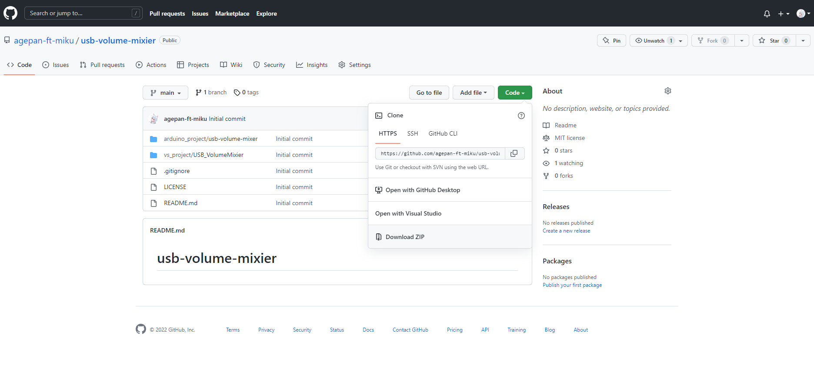
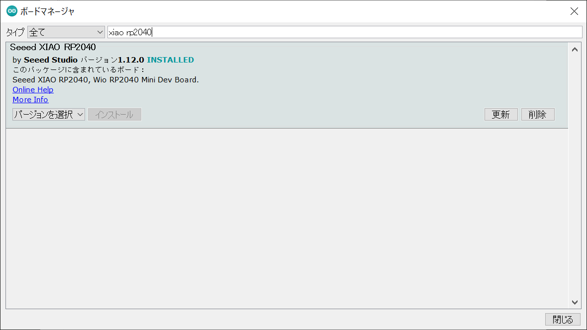
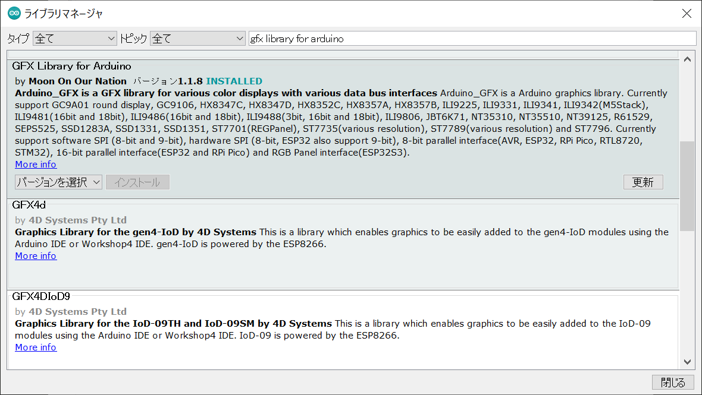
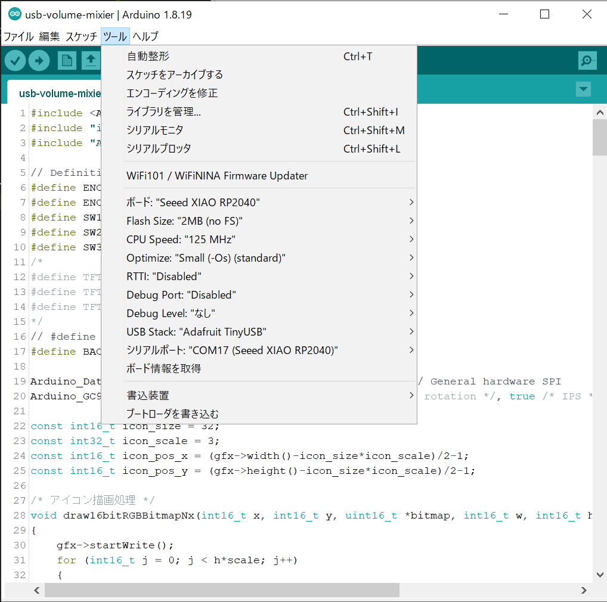
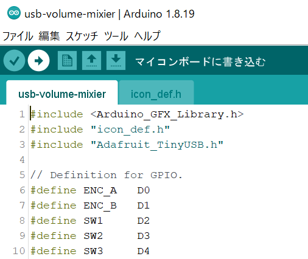
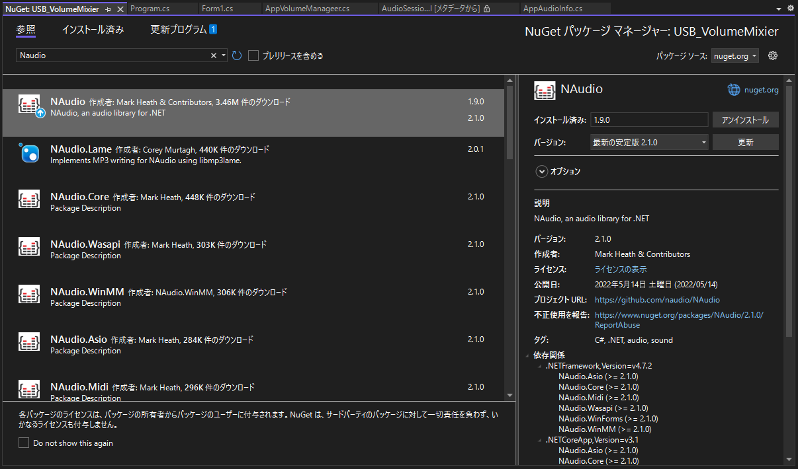
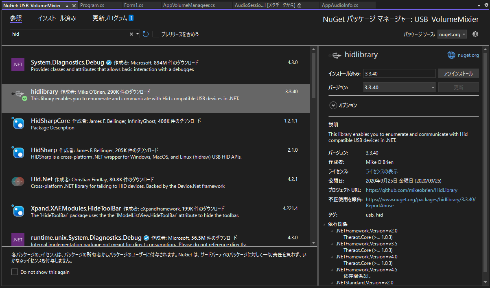
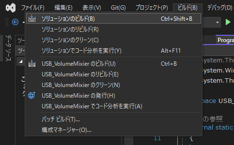
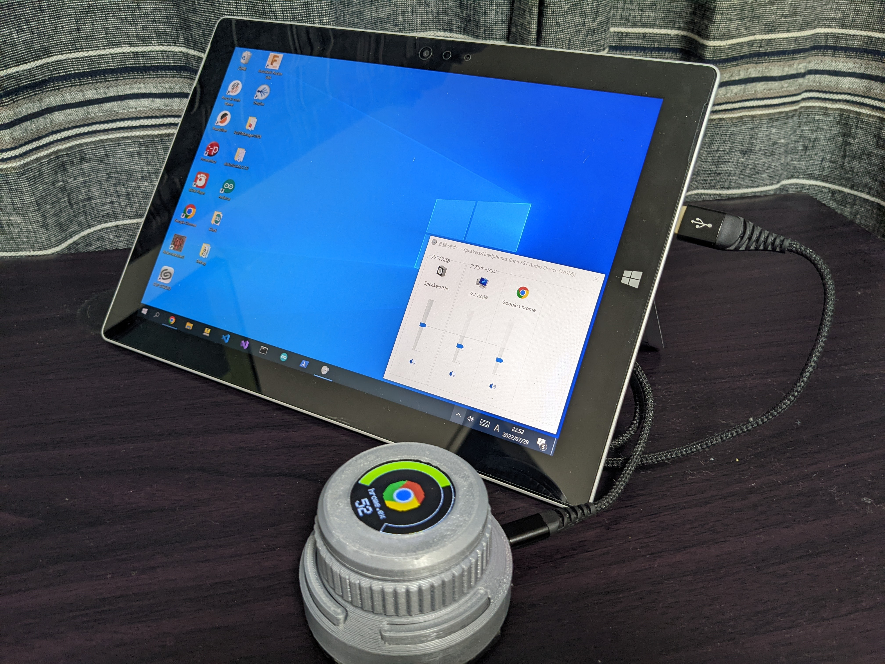

# usb-volume-mixier

## USB音量ミキサーとは？
<blockquote class="twitter-tweet">
USB音量ミキサー完成した！ 音量をアプリ毎に変えられる素敵なデバイスです。 ながら作業のお供に一つ <a href="https://t.co/MeCaaNW36u">pic.twitter.com/MeCaaNW36u</a>
&mdash; あげぱん (@agepan_ft_miku) <a href="https://twitter.com/agepan_ft_miku/status/1557766607664926722?ref_src=twsrc%5Etfw">August 11, 2022</a></blockquote> 

 

# ソースコードのダウンロード

1. 以下からソースコードをダウンロードしてください。

    https://github.com/agepan-ft-miku/usb-volume-mixier

    
 

# USB音量ミキサーのファームウェアの書き込み
1. ダウンロードしたフォルダを開き、arduino_project/usb-volume-mixer.ino をダブルクリックしてArduino IDEで開きます。

2. ”ツール” → ”ボード” → ”ボードマネージャ” から「Seeed XIAO RP2040」をインストールしてください。

    

3. ”スケッチ” → ”ライブラリをインクルード” → ”ライブラリを管理” から「GFX Library for Arduino」をインストールしてください。  

    

4. ”ツール”メニューから、以下の様に設定します。
　シリアルポート（COMXX)は環境によって異なるので、「Seeed XIAO RP2040」の記載がされているものを選んでください。 

	

5. 書き込みボタンをクリックしてファームウェアを書き込みます。

    

 

# USB音量ミキサー制御アプリケーションの作成

1. ダウンロードしたフォルダを開き、vs_project/USB_VolumeMixer.sln をダブルクリックしてVisual Studioで開きます。

2. ”プロジェクト” → ”NuGetパッケージの管理”ツール” から「NAudio」をインストールしてください。
	

3. ”プロジェクト” → ”NuGetパッケージの管理”ツール” から「hidlibrary」をインストールしてください。
	

4. ”ビルド” → ”ソリューションのビルド” を実行し、USB音量ミキサー制御アプリケーションの実行ファイル”USB_VolumeMixer.exe”を作成します。
	

 

# USB音量ミキサーの使い方

1. 前項で作成した”USB_VolumeMixer.exe”を実行します。

2. USB音量ミキサーをUSBケーブルでPCと接続します。

3. PCとUSB音量ミキサーを接続すると、USB音量ミキサーの画面にアプリケーションのアイコンと現在の音量が表示されます。

	

スイッチの機能割り当ては以下となっています。
- SW1	：アプリケーション切り替え(戻る)

- SW2	：ミュート

- SW3	：アプリケーション切り替え(進む)

ロータリーエンコーダは右回転で音量設定増加、左回転で音量設定減少します。
