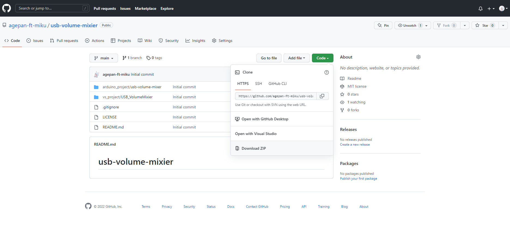
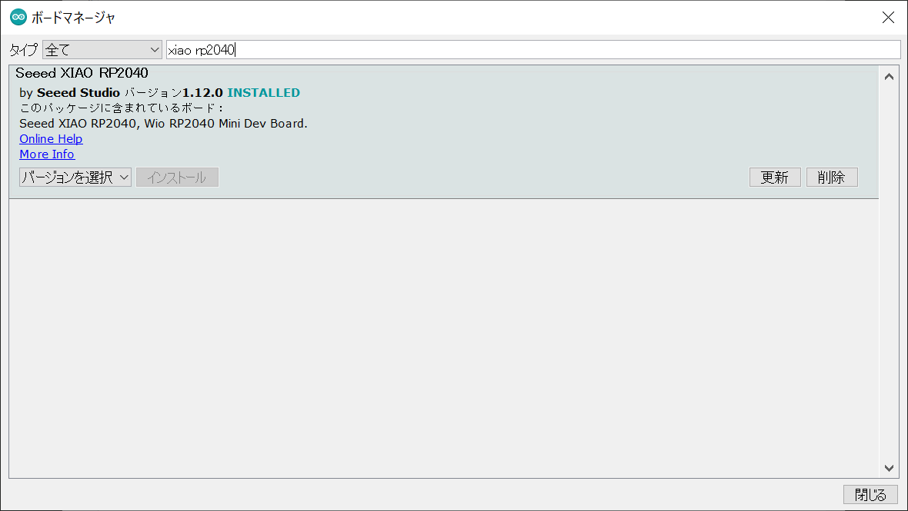
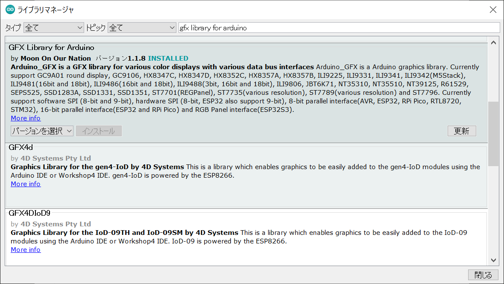
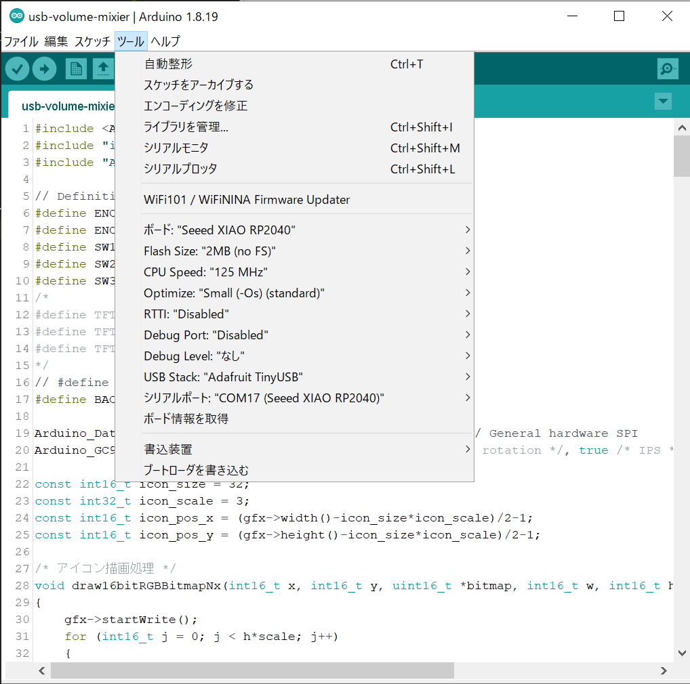
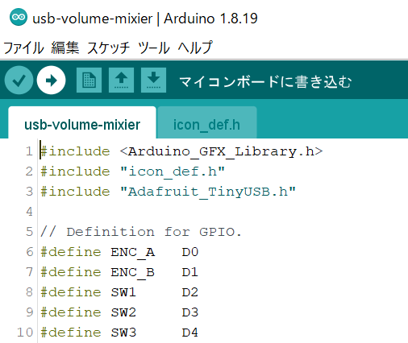
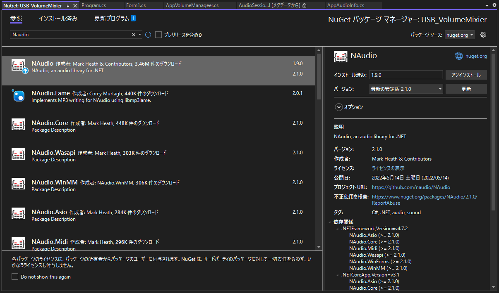
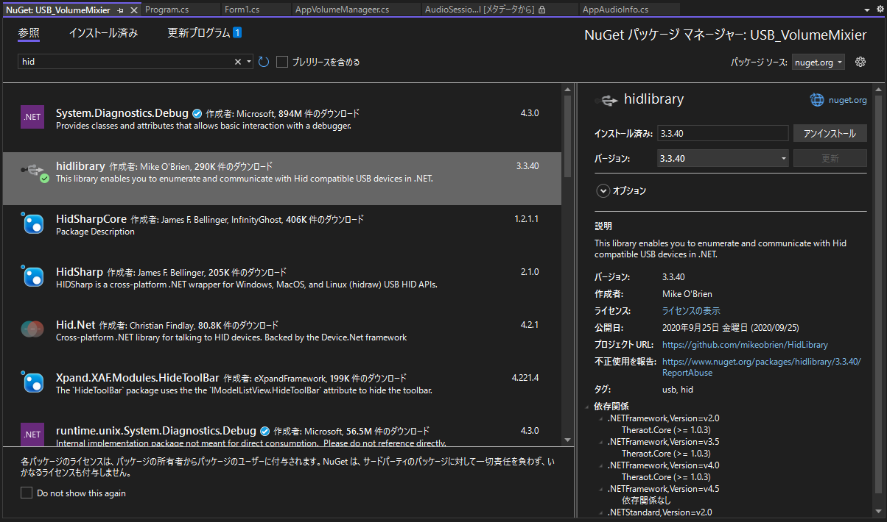
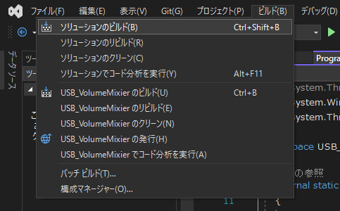

# usb-volume-mixier

### ソースコードのダウンロード

1. 以下からソースコードをダウンロードしてください。

    https://github.com/agepan-ft-miku/usb-volume-mixier

    

### USB音量ミキサーのファームウェアの書き込み
1. ダウンロードしたフォルダを開き、arduino_project/usb-volume-mixer.ino をダブルクリックしてArduino IDEで開きます。

2. ”ツール” → ”ボード” → ”ボードマネージャ” から「Seeed XIAO RP2040」をインストールしてください。

    

3. ”スケッチ” → ”ライブラリをインクルード” → ”ライブラリを管理” から「GFX Library for Arduino」をインストールしてください。  

    

4. ”ツール”メニューから、以下の様に設定します。
　シリアルポート（COMXX)は環境によって異なるので、「Seeed XIAO RP2040」の記載がされているものを選んでください。 

    

5. 書き込みボタンをクリックしてファームウェアを書き込みます。

    

### USB音量ミキサー制御アプリケーションの作成

1. ダウンロードしたフォルダを開き、vs_project/USB_VolumeMixer.sln をダブルクリックしてVisual Studioで開きます。

2. ”プロジェクト” → ”NuGetパッケージの管理”ツール” から「NAudio」をインストールしてください。
	

3. ”プロジェクト” → ”NuGetパッケージの管理”ツール” から「hidlibrary」をインストールしてください。
	

4. ”ビルド” → ”ソリューションのビルド” を実行し、USB音量ミキサー制御アプリケーションの実行ファイルを作成します。
	
